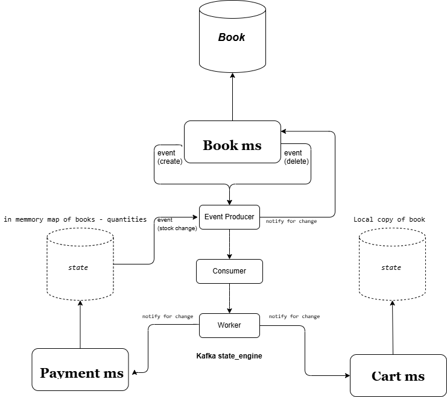

# Server Architecture and Design

## Introduction

This server is designed with a **microservice architecture** aimed at **resilience**, **scalability**, and **responsiveness** to high traffic. The system primarily focuses on the **cart functionality**, which is a critical point for every e-commerce platform. It works closely with mechanisms to efficiently manage high traffic while ensuring data consistency and security.

## Technologies Used

### Tech Stack

- **Backend**:  
- **Caching & Proxy**:   
- **Message Broker**: 
- **Search**: 
- **Containerization**: 
- **Database**: 
- **Testing**:  

### 3rd Party APIs

- **Payment System**: 
- **File Upload**:  (AWS integration in progress)

### High-Level Overview

The server integrates **Redis** and **Nginx** (with Lua scripts via OpenResty) to handle caching and user traffic effectively. It also ensures that no data is lost, even in the event of memory overflow, by using batch updates and custom eviction policies.

### Caching Algorithm

Initially, the algorithm was based within the server, but it was later integrated into a reverse proxy (Nginx) with an extension for Lua scripts (OpenResty). Here's a breakdown of how the system works:

1. **User Interaction**: A new user begins interacting with the server. Initially, the server handles this user’s requests.
2. **Redis Cache**: The system checks the cache and notes that the user has interacted. 
3. **Proxy Handling**: Once the user is identified, all subsequent cart interactions (read or write) are handled by the reverse proxy until user is no longer qualified for a spot in the cache.
4. **User Categorization**: Users are categorized into two groups:
   - High-frequency request users ("active").
   - Low-frequency request users ("calm").
5. **Cache Eviction**: The cache decides which users to serve and which ones to discard by using terms and TTL.
6. **Data Clearance**: Inactive users are cleaned up to prevent memory overflow. A Lua-based mechanism operates in two phases:
   - **Phase 1**: Clears users with no cart changes (term = 0).
   - **Phase 2**: Deletes the least active users if further space is needed (uses events to call a batch synch operation for the evicted carts).
   - **Constant**: TTL is attached to each cart to make sure no inactive carts remain cached (resets on interaction)

**Why**: The mechanism mimmicks an LRU policy while ensuring no data is lost in the process of memmory management,.
In case Redis becomes unavailable, the database can continue functioning to ensure constant availability and opportunity for cutting costs.

*The following charts illustrate the algorithm used for caching and server interactions:*

---

## Performance Testing Results (JMeter)

Below are the results of load testing using **JMeter**, simulating high traffic conditions:
- (please note that the error rate is originating from a misplaced id in the dataset)

| Metric            | Value        |
|------------------|------------|
| **Total Requests (# Samples)** | 667,127      |
| **Average Response Time (ms)** | 69          |
| **Min Response Time (ms)** | 0           |
| **Max Response Time (ms)** | 704         |
| **Standard Deviation (ms)** | 83.20       |
| **Error Rate (%)** | 4.104%      |
| **Throughput (requests/sec)** | 2,195.54    |

## Server Components

The server is built with **five microservices**, each focused on a specific category:

1. **Auth Service**: Manages the state of the users.
2. **Payment Service**: Handles payments, integrates with Stripe for processing, and keeps track of stock levels.
3. **Cart Service**: Manages the user’s cart interactions.
4. **Library Service**: Manages product data and caches frequently requested page items using **eTags** and handles optimized search via Elasticsearch (ES).
5. **Question Service**: Manages interaction between administrators and users.

### Microservices Communication

The **Book Service** is central to the application. It uses **Kafka** for real-time updates to ensure that all microservices that interact with the book model stay synchronized.

## Security and Authentication

The server uses **JWT (JSON Web Token)** and **Spring Security** for secure user **authorization** and **authentication**.

---

### Dockerization

The server is **fully Dockerized** for easy deployment and scalability. The server's core components (Kafka, Redis, Elasticsearch, Nginx) are also containerized, but are still being configured.

---

## Conclusion

The server is designed to handle high traffic efficiently while ensuring data consistency, security, and availability. It uses advanced caching and memory management strategies to handle e-commerce cart functionality and integrates seamlessly with external services like Stripe and Elasticsearch.
